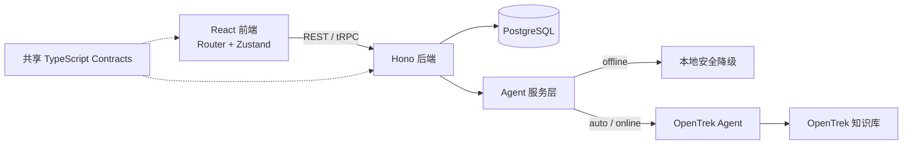

# Lutealark

Lutealark 是一个面向 ADHD 女性的周期感知支持系统。它把低压力对话、周期节奏、呼吸练习和轻量行动工具放在同一个本地优先的产品中，帮助用户在不同能量状态下找到更容易开始的一步。

> Lutealark 用于日常自我支持，不提供医疗诊断或治疗，也不能替代专业医疗服务或紧急援助。

[完整功能说明](docs/FEATURES.md) · [公网部署](deploy/README.md) · [前端与 Android](frontend/README.md) · [OpenTrek 配置与上线](opentrek/README.md)

## 当前状态

| 范围 | 状态 | 说明 |
|---|---|---|
| 本地产品功能 | ✅ 可用 | 对话、周期、呼吸、工具、档案、积分和账号均可本地运行 |
| PostgreSQL | ✅ 已验证 | 迁移、同步、完整导出、删号和全量历史已通过真库测试 |
| 离线助手 | ✅ 已验证 | 不调用 OpenTrek，不伪装成 RAG，提供明确的离线基础支持 |
| 公网部署 | 🟡 模板已就绪 | 已提供 Docker Compose、Caddy 自动 HTTPS、Nginx 和 PostgreSQL 私网部署；仍需云服务器、域名和 DNS 才能得到真实公网网址 |
| Android App | 🟡 Debug APK 已生成 | Capacitor 原生工程和 APK 已完成构建；当前 APK 未绑定公网 API，且尚未完成真机验收 |
| OpenTrek 当前基线 | 🟠 在线可答，RAG 未确认 | 版本仍为 `1785250561438`；2026-08-22 最新实测可创建在线 Session 并回答周期问题，但返回未包含 `ragUsed=true` 或有效来源 |
| RAG 来源验收 | ⏳ 待在线验收 | Q01–Q10 仍需真实 Trace、sourceId 和 Top-3 召回验收 |

当前本地配置保持：

```dotenv
OPENTREK_AGENT_VERSION=1785250561438
OPENTREK_MODE=auto
```

`auto` 模式会先请求 OpenTrek；仅在网络/5xx 故障时降级为本地基础支持，并在消息中明确标识“离线基础支持 · 未使用 OpenTrek/RAG”。聊天页会对初始降级、缓存的离线 Session 和运行中降级做有界自动重连，并提供“重新连接 OpenTrek”手动操作。重连不会清空对话；历史离线回复仍保留真实标记，只有后续成功的在线回复会显示“OpenTrek 在线”。只有 `ragUsed=true` 且存在有效来源时，页面才显示“已使用 RAG”。

候选 OpenTrek 工作流的 metadata 合同现已把 `ragUsed` 设为必填布尔值，并在 Schema 中强制双向一致：`ragUsed=true` 必须同时返回同一次检索的 1–3 条有效来源，`ragUsed=false` 必须返回 `sources=[]`。后端和前端不会根据回答措辞推测 RAG，也不会补造来源；当前已发布基线仍未返回这组证据，因此状态仍是“RAG 未确认”。

如果需要强制联网调试可使用 `online`；没有 VPN 时才使用 `offline`。这里的“离线”只针对 OpenTrek/VPN；账号、服务器档案、积分和跨设备同步仍需要本地后端与 PostgreSQL。当前状态不能证明远端知识库可读、已发布基线包含仓库新增节点，或 Top-3 召回质量已经达标。

公网部署模板默认使用 `OPENTREK_MODE=offline`，因此不依赖 VPN 或 OpenTrek 也能提供账号、周期、记录、工具、积分和明确标识的离线基础问答。它仍需要公网服务器上的后端与 PostgreSQL，不代表纯静态网页可以独立完成全部功能。

`GET /health/opentrek` 只报告本地模式、配置是否完整和 Agent 版本，不主动访问网关，也不会返回密钥。2026-08-19 曾成功完成在线 Session 与普通/周期问答，之后平台又出现 Session 库只读事务和 `run` 无消息。2026-08-20 的六次全新探测曾返回 `mode=offline`；2026-08-22 最新实测已创建在线 Session，发送“黄体晚期为什么更容易注意力飘和疲惫？请结合可靠资料解释个体差异，并给出可核验的来源”后，路由为 `cycle_question`、回复非空，但返回 metadata 未包含 `ragUsed=true`，`sources=[]`，因此页面保持“OpenTrek 在线 · 未确认使用 RAG”。这证明在线问答可达，但还不能证明当前发布基线已执行知识库检索或返回可验证来源。

前端已按两份设计稿实现 Agent 与周期视图：`/cycle` 是默认主页；`/agent` 进入聊天入口与全屏对话。聊天入口态和全屏对话顶栏都有“← 返回周期”，会回到 `/cycle`，但不清空当前对话或 Session；清空只由“新对话”触发。两处返回控件均使用显式至少 44px 的触控高度，不受页面根字号影响。周期页提供今天前 3 天、后 4 天的平滑双激素曲线、云雀飞行轨迹和可点击阶段说明。

`frontend/public/assets/background.jpg` 不再只是页面外围背景；可见的应用大卡片本身、周期主面板、Agent 入口面板和全屏聊天面板都直接使用该图，周期曲线/记录主卡与 Agent 欢迎卡也直接叠加同一水彩图。应用框和主面板桌面取景使用纵向 70%，主卡使用 78% 以露出海岸，再用半透明浅色遮罩保持文字、表单、输入区和安全弹层可读。

## 核心能力

| 模块 | 用户可以做什么 |
|---|---|
| 对话支持 | 设计稿入口卡与全屏聊天、明确返回周期、OpenTrek 手动/有界自动重连、文本或中文语音输入、8 条指定快捷短语、感受记录、来源面板与安全提示 |
| 周期与状态 | 8 天双激素曲线、云雀轨迹、阶段说明、21–35 天圆点周期环、预测记录、每日状态和最近趋势 |
| 呼吸空间 | 选择 5 种呼吸模式，跟随动画和倒计时练习，暂停/继续并记录放松评分 |
| 温和工具 | 今日最多 3 项轻计划、5/10/15/25 分钟专注、环境微调、感官降载和 1–3 分钟微运动 |
| 档案与记忆 | 对话新建/重命名/归档/恢复/删除、消息自动保存与恢复；长期记忆须二次明确同意 |
| 积分 | 完成记录由后端确定性计分，支持幂等、防重复奖励、每日上限和每周目标 |
| 账号与数据 | 邮箱注册登录、匿名数据认领、跨设备同步、完整 JSON 导出和密码复验删号 |

完整交互、规则、数据边界和积分明细见 [docs/FEATURES.md](docs/FEATURES.md)。

## 系统架构



核心原则：

- 周期阶段、积分和身份范围由后端可信逻辑决定，不交给模型或客户端任意填写。
- 当前用户原话优先；历史摘要和长期记忆只提供有限参考，不被当作指令或已验证事实。
- RAG 来源与长期记忆严格分开，危机分支不注入记忆且不展示来源。
- 本地修改先落地，再同步 PostgreSQL；删除使用 tombstone，活动完成使用持久化 outbox 和稳定 UUID。

## 技术栈

- 前端：React 19、TypeScript、Vite、Tailwind CSS、React Router、Zustand
- 后端：Node.js、TypeScript、Hono、tRPC、Zod
- 数据库：PostgreSQL 16
- 智能体：阿里云专有云 OpenTrek Agent Dev V3.2.0
- 测试与质量：Vitest、Oxlint、TypeScript、npm audit

## 本地运行（从 GitHub 克隆后）

下面的流程适用于希望在自己电脑上运行 Lutealark 的合作者。每台电脑都要单独安装 Node.js、PostgreSQL，并分别运行后端和前端；`localhost` 只对运行服务的这台电脑可见，不是一个所有人共享的网址。

### 1. 准备环境

- Git
- Node.js `24.16.0`（根目录 `.nvmrc` 已固定版本）
- PostgreSQL 16
- 需要在线 OpenTrek 时，还要有能访问专有云网关的 VPN 和对应权限

macOS/Linux 如果已安装 nvm：

```bash
nvm install 24.16.0
nvm use 24.16.0
node --version
npm --version
```

Windows 可安装 Node.js `24.16.0` LTS；之后在 PowerShell 或 Git Bash 中确认 `node --version` 和 `npm --version`。

### 2. 下载项目并安装依赖

```bash
git clone https://github.com/Valar-MO/Lutealark.git
cd Lutealark

cd backend
npm ci

cd ../frontend
npm ci
cd ..
```

不要把 `backend/.env`、VPN 配置、OpenTrek Key 或数据库密码提交到 GitHub。

### 3. 安装并初始化 PostgreSQL

macOS/Homebrew 示例：

```bash
brew install postgresql@16
brew services start postgresql@16
/opt/homebrew/opt/postgresql@16/bin/createdb lutealark
/opt/homebrew/opt/postgresql@16/bin/psql -d postgres \
  -c "ALTER DATABASE lutealark SET timezone TO 'Asia/Shanghai'"
```

Linux 可使用发行版的 PostgreSQL 16 包，然后执行等价的 `createdb lutealark` 和时区设置命令。Windows 安装 PostgreSQL 16 后，可在 SQL Shell（psql）中创建名为 `lutealark` 的数据库。若本机 PostgreSQL 要求密码，请使用自己创建的本地数据库用户，并把连接信息写入下一步的 `DATABASE_URL`。

部署到公网时必须使用独立数据库账号、强密码、最小权限和 TLS，且不得把 5432 暴露到公网。

### 4. 配置后端环境变量

```bash
cp backend/.env.example backend/.env
chmod 600 backend/.env  # Windows 可跳过这一行
```

编辑 `backend/.env`。先用离线模式确认本地系统能启动，不需要 VPN 或 OpenTrek Key：

```dotenv
HOST=127.0.0.1
PORT=3000
DATABASE_URL=postgresql://<本机数据库用户>:<本机数据库密码>@127.0.0.1:5432/lutealark
DATABASE_SSL=false
OPENTREK_AGENT_VERSION=1785250561438
OPENTREK_MODE=offline
```

离线模式允许 OpenTrek 的地址、Key 和 Agent code 保持为空。如果本机 PostgreSQL 使用无密码的系统用户认证，按实际情况填写 `DATABASE_URL`，不要机械照抄占位符。离线模式会明确显示“离线基础支持 · 未使用 OpenTrek/RAG”，但周期、记录、工具、账号和 PostgreSQL 同步仍可使用。

### 5. （可选）连接 VPN 并启用 OpenTrek

需要在线 Agent/RAG 时，先连接有权限的 VPN，再在 `backend/.env` 填入管理员安全提供的配置：

```dotenv
OPENTREK_BASE_URL=<VPN 内 OpenTrek 网关地址>
OPENTREK_APP_KEY=<只保存在本机 .env 的密钥>
OPENTREK_AGENT_CODE=<对应 Agent code>
OPENTREK_AGENT_VERSION=1785250561438
OPENTREK_MODE=auto
```

`1785250561438` 是当前约定的 Agent 版本。仓库不再内置任何专网网关默认值；`auto` 或 `online` 模式必须在本机 `.env` 中显式提供上面四项配置，缺少任一项时 `/health/opentrek` 会报告 `misconfigured`。`auto` 会优先请求 OpenTrek，在网络、缺少配置或可重试的 5xx 故障时降级为本地助手；`online` 会强制联网并在失败时返回错误；`offline` 从不访问 OpenTrek。OpenTrek Key、网关地址和 VPN 凭据不能写入前端、README、截图或版本库。修改 `.env` 后需要重启后端。

完成下一步并启动后端后，可检查服务和本地配置状态：

```bash
curl http://127.0.0.1:3000/health
curl http://127.0.0.1:3000/health/opentrek
```

`/health/opentrek` 只检查本地配置，不等于 VPN 网关已经连通；最终是否在线以聊天页的状态和实际问答结果为准。

### 6. 迁移数据库并启动后端

在仓库根目录打开第一个终端，并保持它运行：

```bash
cd backend
npm run db:migrate
npm run dev
```

看到后端监听 `3000` 后不要关闭这个终端。

### 7. 启动前端

在仓库根目录打开第二个终端：

```bash
cd frontend
npm run dev
```

Vite 会把前端的 `/api` 请求代理到 `http://127.0.0.1:3000`，所以本地开发不需要额外配置 CORS。浏览器打开：

- 周期主页：[http://localhost:5173/cycle](http://localhost:5173/cycle)
- 聊天页：[http://localhost:5173/agent](http://localhost:5173/agent)

`/` 和未知路径也会回到 `/cycle`。如果 5173 已被占用：

```bash
npm run dev -- --host 127.0.0.1 --port 5174 --strictPort
```

此时访问 `http://localhost:5174/cycle`。如果其他人要使用，必须在他们自己的电脑重复整套安装、数据库、VPN 和启动步骤；不能只把你的 `localhost` 链接发给他们。

### 8. 停止和重新启动

在两个终端分别按 `Ctrl+C` 停止前端和后端。下次使用时：

1. 启动 PostgreSQL 服务。
2. 需要在线 OpenTrek 时连接 VPN。
3. 先在 `backend/` 执行 `npm run dev`，再在 `frontend/` 执行 `npm run dev`。
4. 打开 `/cycle`；修改环境变量后必须重启后端。

### 9. 常见问题

| 现象 | 检查方法 |
|---|---|
| `npm: command not found` | 安装 Node.js 24.16.0，重新打开终端并确认 `node --version`。 |
| `DATABASE_URL is not configured` | 确认文件名是 `backend/.env`，并已填写 `DATABASE_URL`。 |
| PostgreSQL 连接失败 | 确认 PostgreSQL 服务已启动、数据库 `lutealark` 已创建、用户名/密码和端口正确。 |
| 页面打不开或 API 报错 | 确认后端终端仍在运行；前端默认代理到 `127.0.0.1:3000`。 |
| 页面显示离线基础支持 | `OPENTREK_MODE=offline` 时这是预期结果；`auto` 下则检查 VPN、网关配置、Agent code/version，并重启后端或点击聊天页的重连操作。 |
| 5173 端口被占用 | 按上面的命令改用 5174，并访问对应端口。 |

生产环境部署到独立网址的方案见 [deploy/README.md](deploy/README.md)；它需要云服务器、域名和 DNS，不是 `localhost` 的替代启动命令。

## 公网部署

`deploy/` 已提供可脱离开发电脑运行的生产模板：Caddy 对外提供 80/443 并自动申请 HTTPS 证书，Nginx 托管前端，Hono 后端和 PostgreSQL 运行在 Compose 私有网络中；数据库端口不会暴露到公网。OpenTrek 默认关闭，之后可在具备专网条件时单独启用。

真正得到公网网址还需要一台安装 Docker Compose v2 的云服务器/VPS、一个域名及指向该服务器的 DNS 记录。准备好后在服务器配置 `deploy/.env.production` 并启动：

```bash
cp deploy/.env.production.example deploy/.env.production
docker compose --env-file deploy/.env.production \
  -f deploy/docker-compose.yml -f deploy/docker-compose.caddy.yml up -d --build
```

部署后应验证 `https://你的域名/health`、`/cycle` 和 `/agent`。当前仓库所在电脑没有 Docker、可用域名或公网主机，因此模板已完成静态检查，但尚未生成一个可以直接交付的真实公网 URL。完整步骤、备份和验收边界见 [deploy/README.md](deploy/README.md)。

## 产品页面

| 路由 | 页面 |
|---|---|
| `/agent` | 对话、语音、离线标识、知识来源和 Agent 动作 |
| `/cycle` | 周期轮盘、每日状态、历史编辑/删除和趋势 |
| `/breathing` | 呼吸模式、训练引导、评分和历史记录 |
| `/tools` | 轻计划、专注计时、环境/感官降载和微运动 |
| `/memory` | 对话档案与经同意保存的长期记忆 |
| `/points` | 本周/累计积分、来源分解、最近事件和周目标 |
| `/account` | 注册、登录、同步、数据导出和账号删除 |

`/` 和未知路径会回退到 `/cycle`；浏览器前进/后退会恢复对应页面。

## Android App

前端已接入 Capacitor Android，原生工程位于 `frontend/android/`，包名为 `com.lutealark.app`。App 将 `dist` 打包进本地 WebView，通过构建时 `VITE_API_BASE_URL=https://公网域名` 访问后端；未配置 API 基址时只能验证 UI 和原生能力，不能连接账号、同步或服务器问答。`CAPACITOR_SERVER_URL` 只保留给已部署 HTTPS 网站的内部联调，不作为发布方案。

Android 已实现系统返回键路由、录音权限、禁止系统自动备份、自适应图标和启动图；登录 Token 使用原生安全存储，账号 JSON 导出使用 Filesystem 写入临时缓存并调起系统 Share 面板，结束后尽力清理临时文件。使用 Android SDK 36 和 JDK 21 的 `assembleDebug`、`lintDebug`、`testDebugUnitTest` 已通过，本机 debug APK 位于 `frontend/android/app/build/outputs/apk/debug/app-debug.apk`。APK 属于被忽略的构建产物，不会随 GitHub 仓库分发，其他机器需按文档重新构建。

当前 APK 没有注入公网 API 地址，只适合界面和原生封装验证。域名确定后必须使用 `VITE_API_BASE_URL=https://你的域名 npm run android:build:debug` 重新构建，并在后端精确允许 `CORS_ORIGINS=https://localhost`。登录、中文语音、系统返回键、导出分享和断网恢复仍需安卓真机验收；Play 发布还需要签名 AAB、隐私政策和 Data Safety 配置。具体命令见 [frontend/README.md](frontend/README.md#android)。

## 数据与安全摘要

- 密码使用独立 salt 的 `scrypt` 派生；比较采用 timing-safe 操作。
- Web 登录使用 `HttpOnly; SameSite=Strict` Cookie；Android 使用原生安全存储中的 bearer Token。数据库只保存 token 的 SHA-256。
- 只有来自精确 Capacitor WebView 来源且带客户端标记的登录/注册请求才会收到原生 Token；无效 bearer 不会回退为 Cookie 或匿名身份。
- Agent Session 按账号/匿名设备/公共主体及在线/离线模式绑定 24 小时，数据库只保存 Session Code 哈希。跨主体、过期或模式不符会返回 `409 AGENT_SESSION_RECREATE_REQUIRED`，前端只自动重建并重试一次。
- Cookie 账号身份优先于匿名设备 UUID；匿名 UUID 只是本地数据分区键，不是认证凭据。
- 登录账号可导出完整业务数据；删号必须重新验证邮箱和密码，并级联删除服务器业务数据和会话。
- PostgreSQL 保存全量状态与呼吸历史；产品快照和本地界面窗口只取最近 30 条，不代表删除旧数据。
- 当前采用应用层用户范围隔离，不是 PostgreSQL RLS；公网模板已内置 HTTPS、精确 CORS、反向代理限制和安全头，正式上线仍需核验数据库权限、备份和独立安全审查。

## 测试与质量

```bash
cd backend
npm run db:migrate
npm run check
RUN_AUTH_DB_TESTS=true npm test -- --reporter=dot
npm run build
npm audit
npm run eval:opentrek:validate
npm run eval:opentrek:sources:validate
```

```bash
cd frontend
npm run test
npm run lint
npm run build
npm audit

cd android
./gradlew assembleDebug lintDebug testDebugUnitTest --no-daemon
```

截至 2026-08-22 的验证基线（配置为 `auto`；真实 OpenTrek/RAG Trace 仍待验收）：

- 前端：14 个测试文件、78/78 passed；lint、生产构建、Capacitor Android 同步和完整依赖审计通过。
- 后端：19 个测试文件（18 个通过、1 个按条件跳过），202 passed、3 skipped；迁移、TypeScript check 和生产构建通过。3 个账号真库用例仅在 `RUN_AUTH_DB_TESTS=true` 且配置数据库时运行。
- Android：SDK 36、min SDK 24、target SDK 36；`assembleDebug`、`lintDebug` 和 `testDebugUnitTest` 均成功，已生成 debug APK。
- 前后端依赖审计：0 个已知漏洞。
- OpenTrek 离线数据校验：12 条路由、2 条危机、5 条安全样例结构有效且未联网。
- Q01–Q10 来源样例结构有效，但均等待真实 Trace 标注，尚未达到正式 Top-3 验收条件。
- 前端 `/`、七个功能路由与一个未知路径均 HTTP 200；后端健康端点均 HTTP 200。背景资源 HTTP 200、`image/jpeg`、641,943 bytes，与原始 `背景.jpg` 和 public 资源哈希一致。
- OpenTrek 2026-08-22 最新实测可创建在线 Session 并命中 `cycle_question`，但 `ragUsed` 未返回且来源为空；当前不能声称远端知识库或 RAG 来源门槛通过。
- 2026-08-22 `ragUsed`/`sources` JSON Schema 回归测试 3/3 通过；完整后端套件 202 passed、3 个需 `RUN_AUTH_DB_TESTS=true` 的账号真库用例按设计 skipped。TypeScript 检查、生产构建、两项离线 OpenTrek 数据校验和后端依赖审计通过；来源校验仍为 `valid_but_not_ready`，未调用网络。
- 公网 Compose/Caddy/Nginx 配置已完成静态检查；因为本机没有 Docker、云服务器和域名，本次没有实际启动生产容器或申请公网证书。
- 当前没有 Android 真机或模拟器，APK 的安装、登录、语音、返回键、分享和弱网恢复尚未做设备级验收。
- 内置浏览器当前没有可用实例，因此真实点击、桌面/移动端截图与视觉重叠检查仍需补做；本次未将静态 CSS 断言写成截图验收。

## OpenTrek 上线边界

仓库中的 `opentrek/` 是工作流、P01–P07 Prompt、Schema、标准化脚本和评估数据的版本控制源，但不会自动修改平台。

VPN 恢复后仍需：

1. 复制已发布基线 `1785250561438`，不要直接编辑正在使用的版本。
2. 在平台部署工作流、P01–P07、主动状态邀请和 `savedMemoryContext` 连线；所有结果渲染器都必须输出符合 Schema 的 `ragUsed` 与 `sources` 组合。
3. 发布新候选版本，再更新后端版本号并验证真实 `/createSession`、`/run`、metadata 合同和账号记忆隔离。
4. 从同一候选版本的 Trace 获取真实来源字段和 sourceId，完成 Q01–Q10 标注。
5. 达到行为路由 ≥90%、危机与安全 100%、权威 Top-3 来源召回 ≥80% 后才替换基线。

完整步骤见 [opentrek/README.md](opentrek/README.md)。在这些门槛完成前，不应声称当前基线已经读取 OpenTrek RAG 或包含仓库新增节点。

## 项目结构

```text
Lutealark-feature-cycle-aware-rag/
├─ backend/             Hono、tRPC、PostgreSQL、账号和 OpenTrek 代理
├─ frontend/            React、Vite、Tailwind CSS、Router 和 Zustand
├─ deploy/              Docker Compose、Caddy、Nginx 与公网部署说明
├─ packages/contracts/  前后端共享的 TypeScript 传输类型
├─ opentrek/            工作流、Prompt、Schema、脚本和验收样例
└─ docs/                完整功能与维护文档
```

## 文档维护约定

凡是用户可见功能、页面或接口、数据/安全模型、OpenTrek 状态、配置方式或验证结果发生变化，必须在同一次变更中同步更新：

1. `README.md`：面向 GitHub 访客的项目状态、功能概览和快速开始。
2. `docs/FEATURES.md`：完整功能行为、规则、数据边界和验收状态。

若改动涉及 OpenTrek 平台部署、Prompt、工作流或评估门槛，还必须同步更新 `opentrek/README.md`。测试数字只能在实际运行对应命令后更新。
